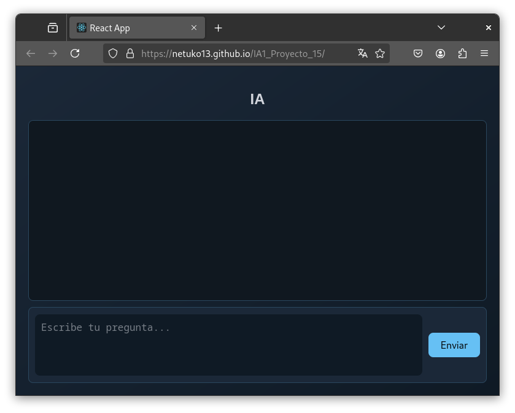

# IA1_Proyecto_15
Proyecto IA

## Contenido
- [Datos de estudiantes](#datos)
- [Manual técnico](#tecnico)
    - [Sequence to Sequence](#seq2seq)
    - [Librerías utilizadas](#librerias)    
- [Manual de usuario](#usuario)


---

<a name="datos"></a>
## Datos de estudiantes
| Carnet | Nombre |
| --- | --- |
| 201403654 | Carlos Antonio Velásquez Castellanos |
| 201020783 | Otto Roman Olivarez Cruz |
| 201503756 | Carlos Ernesto Fuentes Rasique |

---

<a name="tecnico"></a>
## Manual técnico

<a name="seq2seq"></a>
### Sequence to Sequence

El modelo Sequence to Sequence (Seq2Seq) es una arquitectura de aprendizaje profundo muy utilizada en problemas donde tanto la entrada como la salida son secuencias de datos. Este modelo es utilizado por sus diversas aplicaciones como traducción automática que permite convertir un texto a otro; la generación de texto crea respuestas en chatbots; generar resúmenes de documentos largos etc.  


Los componentes principales del modelo Seq2Seq son:

### 1. Codificador:

Toma la secuencia de entrada y la comprime en un vector de contexto (un vector de tamaño fijo que representa la entrada).

### 2. Decodificador:

Toma el vector de contexto del codificador y genera la secuencia de salida paso a paso.

### Funcionamiento básico
1. La entrada es una secuencia (por ejemplo, una oración: ["Hola", "¿cómo", "estás?"]).
2.  El codificador procesa esta secuencia y genera un vector que representa la entrada.
3. El decodificador utiliza este vector para generar la secuencia de salida, paso a paso (por ejemplo, ["Bien", "gracias", "¿y", "tu?"]).

### Entrenamiento
Durante el entrenamiento el codificador y decodificador se entrenan juntos para minimizar una métrica de error (como entropía cruzada) que mide la diferencia entre la salida generada y la secuencia objetivo.

<a name="librerias"></a>
### Librerías utilizadas

Entre las librerías utilizadas podemos mencionar:

| Librería | Descripción |
| --- | --- |
| TensorFlow | Proporciona las herramientas en ```Python``` para construir y entrenar el modelo de aprendizaje profundo (Seq2Seq) usando las capas ```Embedding```, ```LSTM``` y ```Dense```. |
| Pandas | Es utilizado para manejar datos tabulares. En este caso, se utiliza para cargar y procesar el archivo de texto ```spa.txt.```|
| NumPy | Utilizado para realizar operaciones matemáticas eficientes en arreglos, como la creación de matrices de secuencias de entrada y salida. |
| Keras | Es usado para construir el modelo mediante una API de alto nivel que incluye las capas ```Embedding```, ```LSTM```, ```Dense``` y el módulo de manejo de datos (```pad_sequences```). |

---

<a name="usuario"></a>
## Manual de usuario

Pasos para utilizar este CHAT:

### 1. Acceder a la página:

Lo primero que debes hacer es acceder a la página en tu navegador web. Para hacerlo haz click directamente en el siguiente enlace:

[IA1 Proyecto grupo 15](https://netuko13.github.io/IA1_Proyecto_15/)

Este chat de uso libre pero en caso de tener saturación de servidores puede que tengas dificultades para obtener respuestas rápidas. 

### 2. Escribe tu pregunta:

Una vez que hayas accedido a la página, lo siguiente es escribir tu pregunta en el cuadro de texto.

Puedes escribir alguna frase como "Hola" hasta "¿Cómo estás?"

### 3. Espera la respuesta:

Después de escribir tu pregunta, Se procesará tu solicitud y te proporcionará una respuesta en algunos segundos.

Es importante tener en cuenta que funciona mejor con frases claras y concisas, así que trata de formular tu frase de manera clara.

### 4. Revisa la respuesta:

Una vez se te haya proporcionado la respuesta, revísala para asegurar la calida de la respuesta. En algunos casos, es posible que no se proporcione una respuesta precisa o completa. Esto puede deberse a que el model es experimental con fines educativos por lo que falta mucho tiempo de entrenamiento para tener respuestas mas precisas.

### 5. Descripción de la Interfaz 
- En la parte superior el cuadro de mayor tamaño es donde se guarda el listado de los mensajes escritos por el usuario y las respuestas del chat.
- En la parte inferior una caja de texto donde el usuario debe escribir sus consultas. 
- En la parte inferior derecha el boton "Enviar", el cual al ser presionado envia el texto escrito por el usuario para ser procesado y posteriormente dar una respuesta. 


