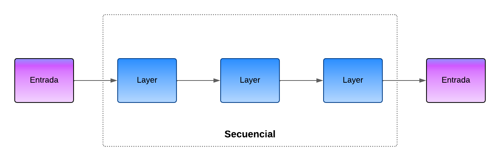
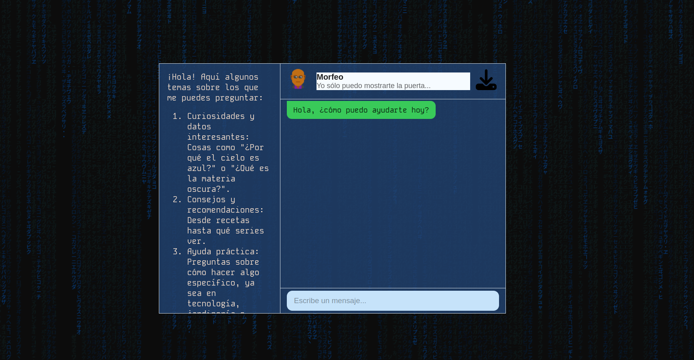

# IA1_Proyecto_15
Proyecto IA Fase 2

## Contenido
- [Datos de estudiantes](#datos)
- [Manual técnico](#tecnico)
    - [Secuencial](#secuencial)
    - [Librerías utilizadas](#librerias)    
- [Manual de usuario](#usuario)


---

<a name="datos"></a>
## Datos de estudiantes
| Carnet | Nombre |
| --- | --- |
| 201403654 | Carlos Antonio Velásquez Castellanos |
| 201020783 | Otto Roman Olivarez Cruz |
| 201503756 | Carlos Ernesto Fuentes Rasique |

---

<a name="tecnico"></a>
## Manual técnico

<a name="secuencial"></a>
### Secuencial


Tensorflow secuencial es el grupo que contiene la pila de formato lineal que consta de varias capas del paquete de biblioteca tf.keras.Model. Esta clase Sequential se hereda de las clases Module, Layer y Model. La funcionalidad básica de Sequential es realizar la provisión de inferencias y el entrenamiento del módulo.El modelo secuencial de Tensorflow se puede implementar mediante la API secuencial. La metodología que se sigue durante la construcción del modelo es paso a paso y se trabaja en una sola capa en un momento determinado. La API de tensorflow secuencial es la forma más sencilla de ejecutar y crear los modelos de Keras. 




El modelo secuencial de TensorFlow es una forma sencilla de construir redes neuronales apilando capas de manera lineal, donde cada capa tiene una única entrada y una única salida. Los principales componentes de este modelo son:

### 1. Preprocesamiento de texto:

* Tokenización: Separar el texto en unidades (palabras o subpalabras).
* Normalización: Convertir el texto a un formato estándar por ejemplo, pasar todo a minúsculas, eliminar puntuación innecesaria.
* Eliminación de stopwords: Eliminar palabras comunes que no aportan significado relevante.
* Lematización o stemming: Reducir las palabras a su raíz o forma base.
### 2. Representación de las palabras:

* Word embeddings: Técnicas como Word2Vec, GloVe, o representaciones subpalabra para convertir las palabras en vectores numéricos densos que representan el significado semántico.
* One-hot encoding: Una representación binaria donde cada palabra se convierte en un vector con un único valor '1' en la posición correspondiente a su índice.

### 3. Clasificador de intentos:

* Después de procesar las entradas, el modelo clasifica la intención de la consulta del usuario, generalmente usando una capa densa al final de la red neuronal.
* Se utiliza una función de activación como Softmax para asignar probabilidades a las diferentes clases de intención.

### 4. Entrenamiento y validación:

* Se necesita un conjunto de datos etiquetado que contenga ejemplos de texto junto con las intenciones correspondientes.
* El modelo se entrena utilizando una función de pérdida y un optimizador como Adam o SGD.

### 5. Manejo de las respuestas:

* Una vez que el modelo predice la intención del usuario, puede generar una respuesta mediante un sistema de plantillas, un generador de texto o acciones específicas.

### 6. Postprocesamiento:

* Asegurarse de que las respuestas generadas sean coherentes y naturales.
* Filtrar o modificar la respuesta según la información adicional contextual o específica de la aplicación.

### Funcionamiento básico
1. La entrada es una secuencia (por ejemplo, una oración: ["Hola", "¿cómo", "estás?"]).
2.  El codificador procesa esta secuencia y genera un vector que representa la entrada.
3. El decodificador utiliza este vector para generar la secuencia de salida, paso a paso (por ejemplo, ["Bien", "gracias", "¿y", "tu?"]).


<a name="librerias"></a>
### Librerías utilizadas

Entre las librerías utilizadas podemos mencionar:

| Librería | Descripción |
| --- | --- |
| Pandas | Es utilizado para manejar datos tabulares. En este caso, se utiliza para cargar y procesar el archivo de texto. |
| NumPy | Utilizado para realizar operaciones matemáticas eficientes en arreglos, como la creación de matrices de secuencias de entrada y salida. |
| @tensorflow/tfjs  | Es una biblioteca de JavaScript que permite ejecutar y desarrollar modelos de TensorFlow directamente en el navegador o en entornos de Node.js. TensorFlow es una plataforma de código abierto muy popular en el campo de la inteligencia artificial. |

### Ejemplo de archivo de entrada
---
```json
"intents": {
   [
      {
         "tag": "greeting",
         "patterns": [
            "Hi",
            "How are you?",
            "Is anyone there?",
            "Hello",
            "Good day",
            "What's up",
            "how are ya",
            "heyy",
            "whatsup",
            "??? ??? ??"
         ],
         "responses": [
            "Hello!",
            "Good to see you again!",
            "Hi there, how can I help?"
         ],
         "context_set": ""
      },
      {
         "tag": "goodbye",
         "patterns": [
            "cya",
            "see you",
            "bye bye",
            "See you later",
            "Goodbye",
            "I am Leaving",
            "Bye",
            "Have a Good day",
            "talk to you later",
            "ttyl",
            "i got to go",
            "gtg"
         ],
         "responses": [
            "Sad to see you go :(",
            "Talk to you later",
            "Goodbye!",
            "Come back soon"
         ],
         "context_set": ""
      },
      {
         "tag": "creator",
         "patterns": [
            "what is the name of your developers",
            "what is the name of your creators",
            "what is the name of the developers",
            "what is the name of the creators",
            "who created you",
            "your developers",
            "your creators",
            "who are your developers",
            "developers",
            "you are made by",
            "you are made by whom",
            "who created you",
            "who create you",
            "creators",
            "who made you",
            "who designed you"
         ],
         "responses": [
            "College students"
         ],
         "context_set": ""
      }
   ]
}

```

<a name="usuario"></a>
## Manual de usuario

Pasos para utilizar este CHAT:

### 1. Acceder a la página:

Lo primero que debes hacer es acceder a la página en tu navegador web. Para hacerlo haz click directamente en el siguiente enlace:

[IA1 Proyecto grupo 15](https://netuko13.github.io/IA1_Proyecto_15/)

Este chat de uso libre pero en caso de tener saturación de servidores puede que tengas dificultades para obtener respuestas rápidas. 

### 2. Escribe tu pregunta:

Una vez que hayas accedido a la página, lo siguiente es escribir tu pregunta en el cuadro de texto.

Puedes escribir alguna frase como "Hola" hasta "¿Cómo estás?"

### 3. Espera la respuesta:

Después de escribir tu pregunta, Se procesará tu solicitud y te proporcionará una respuesta en algunos segundos.

Es importante tener en cuenta que funciona mejor con frases claras y concisas, así que trata de formular tu frase de manera clara.

### 4. Revisa la respuesta:

Una vez se te haya proporcionado la respuesta, revísala para asegurar la calida de la respuesta. En algunos casos, es posible que no se proporcione una respuesta precisa o completa. Esto puede deberse a que el model es experimental con fines educativos por lo que falta mucho tiempo de entrenamiento para tener respuestas mas precisas.

### 5. Descripción de la Interfaz 
- En la parte superior el cuadro de mayor tamaño es donde se guarda el listado de los mensajes escritos por el usuario y las respuestas del chat.
- En la parte inferior una caja de texto donde el usuario debe escribir sus consultas. 
- En la parte inferior derecha el boton "Enviar", el cual al ser presionado envia el texto escrito por el usuario para ser procesado y posteriormente dar una respuesta. 


