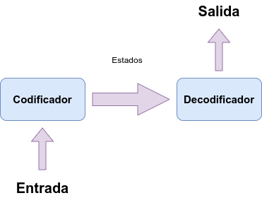

# IA1_Proyecto_15
Proyecto IA

## Contenido
- [Datos de estudiantes](#datos)
- [Manual técnico](#tecnico)
    - [Sequence to Sequence](#seq2seq)
    - [Librerías utilizadas](#librerias)    
- [Manual de usuario](#usuario)


---

<a name="datos"></a>
## Datos de estudiantes
| Carnet | Nombre |
| --- | --- |
| 201403654 | Carlos Antonio Velásquez Castellanos |
| 201020783 | Otto Roman Olivarez Cruz |
| 201503756 | Carlos Ernesto Fuentes Rasique |

---

<a name="tecnico"></a>
## Manual técnico

<a name="seq2seq"></a>
### Sequence to Sequence

El modelo Sequence to Sequence (Seq2Seq) es una arquitectura de aprendizaje profundo muy utilizada en problemas donde tanto la entrada como la salida son secuencias de datos. Este modelo es utilizado por sus diversas aplicaciones como traducción automática que permite convertir un texto a otro; la generación de texto crea respuestas en chatbots; generar resúmenes de documentos largos etc.  



Los componentes principales del modelo Seq2Seq son:

### 1. Codificador:

Toma la secuencia de entrada y la comprime en un vector de contexto (un vector de tamaño fijo que representa la entrada).

### 2. Decodificador:

Toma el vector de contexto del codificador y genera la secuencia de salida paso a paso.

### Funcionamiento básico
1. La entrada es una secuencia (por ejemplo, una oración: ["Hola", "¿cómo", "estás?"]).
2.  El codificador procesa esta secuencia y genera un vector que representa la entrada.
3. El decodificador utiliza este vector para generar la secuencia de salida, paso a paso (por ejemplo, ["Bien", "gracias", "¿y", "tu?"]).

### Entrenamiento
Durante el entrenamiento el codificador y decodificador se entrenan juntos para minimizar una métrica de error (como entropía cruzada) que mide la diferencia entre la salida generada y la secuencia objetivo.

<a name="librerias"></a>
### Librerías utilizadas

Entre las librerías utilizadas podemos mencionar:

| Librería | Descripción |
| --- | --- |
| TensorFlow | Proporciona las herramientas en ```Python``` para construir y entrenar el modelo de aprendizaje profundo (Seq2Seq) usando las capas ```Embedding```, ```LSTM``` y ```Dense```. |
| Pandas | Es utilizado para manejar datos tabulares. En este caso, se utiliza para cargar y procesar el archivo de texto ```spa.txt.```|
| NumPy | Utilizado para realizar operaciones matemáticas eficientes en arreglos, como la creación de matrices de secuencias de entrada y salida. |
| Keras | Es usado para construir el modelo mediante una API de alto nivel que incluye las capas ```Embedding```, ```LSTM```, ```Dense``` y el módulo de manejo de datos (```pad_sequences```). |

---

<a name="usuario"></a>
## Manual de usuario